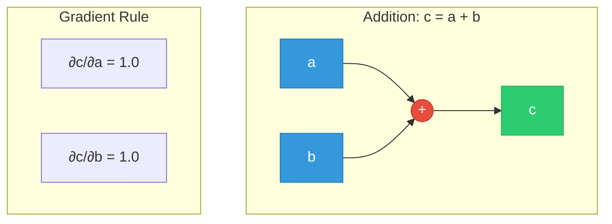
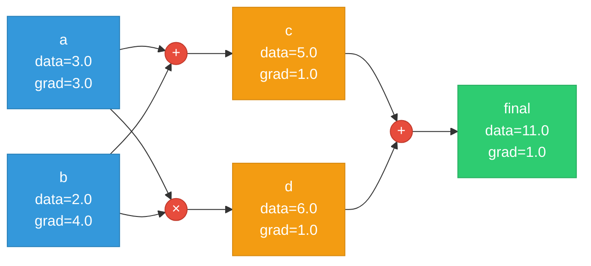
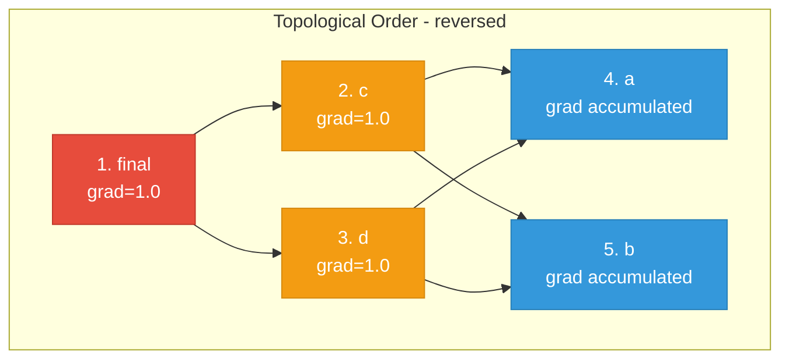
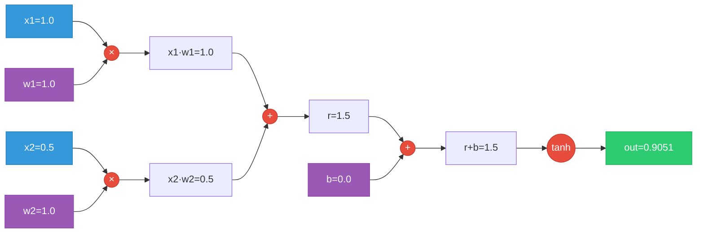
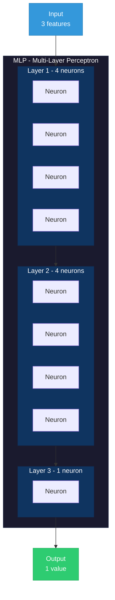
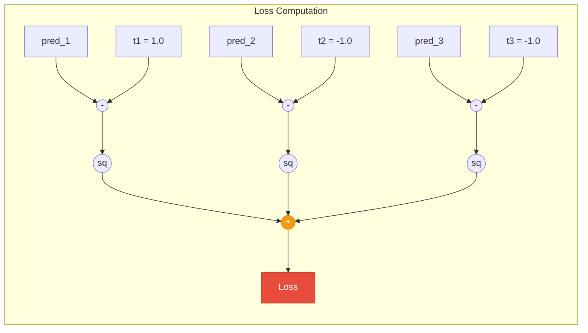
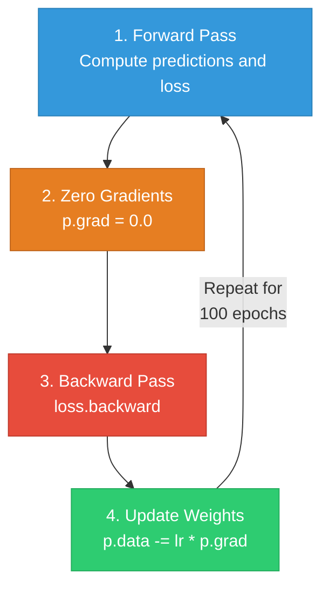
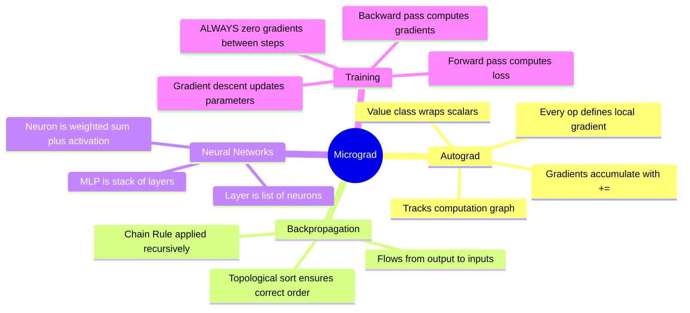

# 🧠 Micrograd from Scratch

> **A tiny autograd engine and neural network library — built from zero, understood deeply.**

[](https://python.org)
[](https://pytorch.org)
[](LICENSE)

This repository contains my **personal notes and implementation** of [Andrej Karpathy's micrograd](https://github.com/karpathy/micrograd) — a minimalist, scalar-valued autograd engine that implements backpropagation over a dynamically-built computation graph (DAG). On top of the autograd engine, a small neural network library is built, with a PyTorch-like API.

The entire thing is **~100 lines of pure Python**. No frameworks, no magic — just calculus and code.

---

## 📑 Table of Contents

- [Why Micrograd?](#-why-micrograd)
- [The Big Picture](#-the-big-picture)
- [Part 1 — Derivatives: The Foundation](#part-1--derivatives-the-foundation)
- [Part 2 — The Value Class: Our Autograd Engine](#part-2--the-value-class-our-autograd-engine)
- [Part 3 — Computational Graphs & Visualization](#part-3--computational-graphs--visualization)
- [Part 4 — Backpropagation: The Chain Rule in Action](#part-4--backpropagation-the-chain-rule-in-action)
- [Part 5 — A Single Neuron: Forward & Backward](#part-5--a-single-neuron-forward--backward)
- [Part 6 — Building Tanh from Primitives](#part-6--building-tanh-from-primitives)
- [Part 7 — PyTorch Validation](#part-7--pytorch-validation)
- [Part 8 — Neural Network Architecture: Neuron → Layer → MLP](#part-8--neural-network-architecture-neuron--layer--mlp)
- [Part 9 — Loss Functions & The Training Loop](#part-9--loss-functions--the-training-loop)
- [Part 10 — Gradient Descent: Learning](#part-10--gradient-descent-learning)
- [Key Takeaways](#-key-takeaways)
- [How to Run](#-how-to-run)
- [Repository Structure](#-repository-structure)
- [Disclaimer](#-disclaimer)

---

## 🤔 Why Micrograd?

Modern deep learning frameworks (PyTorch, TensorFlow) feel like magic. You call `.backward()` and gradients appear. But **what actually happens?**

Micrograd strips away every abstraction and answers that question. By building an autograd engine from scratch, we understand:

- How **derivatives** flow backward through a computation graph
- How the **chain rule** is the _only_ algorithm you need for backpropagation
- How **neurons, layers, and MLPs** are just nested math expressions
- How **gradient descent** tunes weights to minimize loss

---

## 🗺 The Big Picture

The entire flow from a raw math expression to a trained neural network:

```mermaid
flowchart LR
    A["📐 Derivatives\n& Calculus"] --> B["⚙️ Value Class\n(Autograd Engine)"]
    B --> C["🌳 Computational\nGraph (DAG)"]
    C --> D["⛓ Backpropagation\n(Chain Rule)"]
    D --> E["🔮 Neuron\nSimulation"]
    E --> F["🏗 Neural Network\n(Neuron → Layer → MLP)"]
    F --> G["📉 Loss Function\n(MSE)"]
    G --> H["🔁 Training Loop\n(Gradient Descent)"]
    H --> I["✅ Trained Model"]

    style A fill:#4A90D9,stroke:#2C5F8A,color:#fff
    style B fill:#7B68EE,stroke:#5B48CE,color:#fff
    style C fill:#E67E22,stroke:#C0651B,color:#fff
    style D fill:#E74C3C,stroke:#C0392B,color:#fff
    style E fill:#2ECC71,stroke:#27AE60,color:#fff
    style F fill:#1ABC9C,stroke:#16A085,color:#fff
    style G fill:#F39C12,stroke:#D68910,color:#fff
    style H fill:#9B59B6,stroke:#8E44AD,color:#fff
    style I fill:#2ECC71,stroke:#27AE60,color:#fff
```



---

## Part 1 — Derivatives: The Foundation

Everything starts with the derivative. We begin by defining a simple function and visualizing it:

```python
def f(x):
    return x**2 + 2*x**3
```

```python
y_s = f(np.linspace(-5, 5, 100))
plt.plot(np.linspace(-5, 5, 100), y_s)
```

**What we're doing:** Before we build anything, we need to internalize what a derivative _is_. For `f(x) = x² + 2x³`, the derivative `f'(x) = 2x + 6x²` tells us the **rate of change** — _how much does the output wiggle if we wiggle the input?_

This "wiggle" intuition is the **single most important concept** in all of backpropagation:

> **The gradient of a parameter tells us: if I nudge this parameter a tiny amount, how much does the loss change?**

---

## Part 2 — The Value Class: Our Autograd Engine

The `Value` class is the heart of micrograd. Every number becomes a `Value` object that:
1. **Stores data** (the actual number)
2. **Tracks its children** (what produced it)
3. **Remembers the operation** that created it
4. **Computes its own gradient** via `_backward()`

```python
class Value:
    def __init__(self, data, _children=(), _op='', label=''):
        self.data = data           # the actual scalar value
        self._prev = set(_children)  # parent nodes in the DAG
        self._op = _op             # the operation that produced this node
        self.label = label         # for visualization
        self._backward = lambda: None  # gradient computation function
        self.grad = 0.0            # accumulated gradient (∂Loss/∂self)
```

### Supported Operations & Their Local Gradients

Each operation defines how gradients flow backward:



| Operation | Forward | Local Gradient (∂out/∂self) | Code |
|-----------|---------|----------------------------|------|
| `a + b` | `a.data + b.data` | `1.0` (for both a and b) | `self.grad += out.grad` |
| `a * b` | `a.data * b.data` | `b.data` (for a), `a.data` (for b) | `self.grad += other.data * out.grad` |
| `a ** n` | `a.data ** n` | `n * a.data^(n-1)` | `self.grad += (n * self.data**(n-1)) * out.grad` |
| `exp(a)` | `e^(a.data)` | `e^(a.data)` = `out.data` | `self.grad += out.data * out.grad` |
| `tanh(a)` | `tanh(a.data)` | `1 - tanh²(a.data)` | `self.grad += (1 - t**2) * out.grad` |

### The Full Implementation

```python
def __add__(self, other):
    other = other if isinstance(other, Value) else Value(other)
    out = Value(self.data + other.data, (self, other), '+')

    def _backward():
        self.grad += out.grad    # ∂L/∂a = ∂L/∂c * ∂c/∂a = out.grad * 1.0
        other.grad += out.grad   # ∂L/∂b = ∂L/∂c * ∂c/∂b = out.grad * 1.0
    out._backward = _backward
    return out

def __mul__(self, other):
    other = other if isinstance(other, Value) else Value(other)
    out = Value(self.data * other.data, (self, other), '*')

    def _backward():
        self.grad += other.data * out.grad  # ∂L/∂a = ∂L/∂c * b
        other.grad += self.data * out.grad  # ∂L/∂b = ∂L/∂c * a
    out._backward = _backward
    return out

def __pow__(self, other):
    assert isinstance(other, (int, float))
    out = Value(self.data ** other, (self,), f'**{other}')

    def _backward():
        self.grad += (other * self.data ** (other - 1)) * out.grad
    out._backward = _backward
    return out

def exp(self):
    x = self.data
    out = Value(math.exp(x), (self,), 'exp')

    def _backward():
        self.grad += out.data * out.grad   # d/dx(e^x) = e^x
    out._backward = _backward
    return out

def tanh(self):
    x = self.data
    t = (math.exp(2*x) - 1) / (math.exp(2*x) + 1)
    out = Value(t, (self,), 'tanh')

    def _backward():
        self.grad += (1 - t**2) * out.grad  # d/dx(tanh(x)) = 1 - tanh²(x)
    out._backward = _backward
    return out
```

> **Key insight: `self.grad += ...` (not `=`)**. We use `+=` because a node might be used in multiple expressions. Gradients **accumulate** — this is the multivariate chain rule in action.

### Helper Operations

These are built from the primitives above — no new backward functions needed:

```python
def __neg__(self):          # -self
    return self * -1

def __sub__(self, other):   # self - other
    return self + (-other)

def __truediv__(self, other): # self / other  →  self * other^(-1)
    return self * other**-1

def __rmul__(self, other):  # other * self  (handles 2 * Value)
    return self * other
```

---

## Part 3 — Computational Graphs & Visualization

Every expression builds a **Directed Acyclic Graph (DAG)**. We visualize it using Graphviz:

```python
from graphviz import Digraph

def trace(root):
    """Walk the graph and collect all nodes and edges."""
    nodes, edges = set(), set()
    def build(v):
        if v not in nodes:
            nodes.add(v)
            for child in v._prev:
                edges.add((child, v))
                build(child)
    build(root)
    return nodes, edges

def draw_dot(root):
    """Render the computation graph as a visual diagram."""
    dot = Digraph(format='svg', graph_attr={'rankdir': 'LR'})
    nodes, edges = trace(root)
    for n in nodes:
        uid = str(id(n))
        dot.node(name=uid,
                 label="{ %s | data %.4f | grad %.4f }" % (n.label, n.data, n.grad),
                 shape='record')
        if n._op:
            dot.node(name=uid + n._op, label=n._op)
            dot.edge(uid + n._op, uid)
    for n1, n2 in edges:
        dot.edge(str(id(n1)), str(id(n2)) + n2._op)
    return dot
```

### Example Graph

```python
a = Value(3.0, label='a')
b = Value(2.0, label='b')
c = a + b; c.label = 'c'       # c = 5.0
d = a * b; d.label = 'd'       # d = 6.0
final = c + d; final.label = 'final'  # final = 11.0
```



> **Why `a.grad = 3.0`?** Because `a` is used **twice**: once in `c = a + b` and once in `d = a * b`. From the `+` path: grad = 1.0. From the `*` path: grad = b.data = 2.0. Total: **1.0 + 2.0 = 3.0**. This is why we use `+=`.

---

## Part 4 — Backpropagation: The Chain Rule in Action

Backpropagation is just the **chain rule** applied in reverse topological order across the computation graph.

### The `backward()` Method

```python
def backward(self):
    # Step 1: Build topological ordering of the graph
    topo = []
    visited = set()
    def build_topo(v):
        if v not in visited:
            visited.add(v)
            for child in v._prev:
                build_topo(child)
            topo.append(v)
    build_topo(self)

    # Step 2: Set the gradient of the output to 1.0 (seed)
    self.grad = 1.0

    # Step 3: Walk nodes in reverse topological order
    for node in reversed(topo):
        node._backward()
```

### Why Topological Sort?



We process nodes from **output → inputs** (reversed topo order) so that when we reach a node, all of its consumers have already pushed their gradients to it.

### The Chain Rule — Visually

For any path through the graph, gradients multiply:

```
∂Loss/∂a = ∂Loss/∂final × ∂final/∂c × ∂c/∂a    (through the + path)
         + ∂Loss/∂final × ∂final/∂d × ∂d/∂a    (through the × path)
         = 1.0 × 1.0 × 1.0 + 1.0 × 1.0 × b
         = 1.0 + 2.0
         = 3.0  ✓
```

---

## Part 5 — A Single Neuron: Forward & Backward

A neuron computes: **out = tanh(x₁·w₁ + x₂·w₂ + b)**

```python
# inputs
x1 = Value(1.0, label='x1')
x2 = Value(0.5, label='x2')
# weights (synapses)
w1 = Value(1.0, label='w1')
w2 = Value(1.0, label='w2')
# bias
b = Value(0.0, label='b')

# forward pass
x1w1 = x1 * w1; x1w1.label = 'x1*w1'
x2w2 = x2 * w2; x2w2.label = 'x2*w2'
r = x1w1 + x2w2; r.label = 'r'
r_b = r + b; r_b.label = 'r_b'
out = r_b.tanh(); out.label = 'out'
```



After `out.backward()`, every node in the graph has a gradient — telling us how much each input and weight affects the output.

---

## Part 6 — Building Tanh from Primitives

To prove that our autograd engine works with any decomposition, we rebuild `tanh` from its mathematical definition:

$$\tanh(x) = \frac{e^x - e^{-x}}{e^x + e^{-x}}$$

```python
exp_r_b = r_b.exp()
exp_neg_r_b = (-r_b).exp()
out = (exp_r_b - exp_neg_r_b) / (exp_r_b + exp_neg_r_b)
```

**The gradients match exactly** — whether we use the built-in `tanh()` or decompose it into `exp`, `+`, `-`, `/`. This proves our chain rule implementation is correct.

> This is a powerful idea: you can implement **any differentiable function** by composing primitives, and the autograd engine will figure out the gradients automatically.

---

## Part 7 — PyTorch Validation

We validate our engine against PyTorch to make sure we get the same numbers:

```python
import torch

x1 = torch.tensor(1.0, requires_grad=True)
x2 = torch.tensor(0.5, requires_grad=True)
w1 = torch.tensor(1.0, requires_grad=True)
w2 = torch.tensor(1.0, requires_grad=True)
b  = torch.tensor(0.0, requires_grad=True)

net = x1 * w1 + x2 * w2 + b
out = torch.tanh(net)
out.backward()

print(x1.grad, x2.grad, w1.grad, w2.grad, b.grad)
```

✅ **Result: The gradients from our `Value` class match PyTorch exactly.** Our tiny engine does the same thing as a production framework — just on scalars instead of tensors.

---

## Part 8 — Neural Network Architecture: Neuron → Layer → MLP

With our autograd engine working, we build a neural network library on top of it:



### Neuron

A single neuron: **weighted sum → activation**

```python
class Neuron:
    def __init__(self, nin):
        self.w = [Value(np.random.randn()) for _ in range(nin)]  # random weights
        self.b = Value(0.0)                                       # bias

    def __call__(self, x):
        # w · x + b
        act = sum((wi*xi for wi, xi in zip(self.w, x)), self.b)
        out = act.tanh()
        return out

    def parameters(self):
        return self.w + [self.b]
```

### Layer

A layer is just a list of neurons that all see the same input:

```python
class Layer:
    def __init__(self, nin, nout):
        self.neurons = [Neuron(nin) for _ in range(nout)]

    def __call__(self, x):
        out = [n(x) for n in self.neurons]
        return out

    def parameters(self):
        return [p for n in self.neurons for p in n.parameters()]
```

### MLP (Multi-Layer Perceptron)

An MLP chains layers together:

```python
class MLP:
    def __init__(self, nin, nouts):
        sz = [nin] + nouts
        self.layers = [Layer(sz[i], sz[i+1]) for i in range(len(nouts))]

    def __call__(self, x):
        for layer in self.layers:
            x = layer(x)
        return x[0] if len(x) == 1 else x

    def parameters(self):
        return [p for layer in self.layers for p in layer.parameters()]
```

### Our Network: `MLP(3, [4, 4, 1])`

```python
mlp = MLP(3, [4, 4, 1])
print(len(mlp.parameters()))  # 41 parameters total
```

| Layer | Input Size | Output Size | Weights | Biases | Total Params |
|-------|-----------|-------------|---------|--------|-------------|
| Layer 1 | 3 | 4 | 3×4 = 12 | 4 | **16** |
| Layer 2 | 4 | 4 | 4×4 = 16 | 4 | **20** |
| Layer 3 | 4 | 1 | 4×1 = 4 | 1 | **5** |
| **Total** | | | **32** | **9** | **41** |

---

## Part 9 — Loss Functions & The Training Loop

### Dataset

```python
xs = [
    [2.0, 3.0, -1.0],   # input 1
    [3.0, -1.0, 0.5],   # input 2
    [0.5, 1.0, 1.0],    # input 3
]
targets = [1.0, -1.0, -1.0]   # desired outputs
```

### Mean Squared Error Loss

```python
loss = sum(((y - t)**2 for y, t in zip(ys, targets)), Value(0.0))
```



**Loss = Σ(ŷᵢ - tᵢ)²** — the sum of squared differences between predictions and targets.

---

## Part 10 — Gradient Descent: Learning

### The Training Loop

```python
for k in range(100):
    # 1. FORWARD PASS — compute predictions
    ys = [mlp(x) for x in xs]
    loss = sum(((y - t)**2 for y, t in zip(ys, targets)), Value(0.0))

    # 2. ZERO GRADIENTS — critical! gradients accumulate by default
    for p in mlp.parameters():
        p.grad = 0.0

    # 3. BACKWARD PASS — compute all gradients
    loss.backward()

    # 4. UPDATE WEIGHTS — nudge each parameter in the direction that reduces loss
    for p in mlp.parameters():
        p.data -= 0.01 * p.grad   # learning rate = 0.01
```



### ⚠️ Why Zero Gradients?

Because our `_backward()` methods use `+=` (accumulation), if we don't zero the gradients before each backward pass, they will **add up across epochs** and give completely wrong updates. This is the most common bug in neural network training.

### The Gradient Descent Update Rule

```
parameter_new = parameter_old - learning_rate × gradient
```

- **Gradient is positive** → parameter is _increasing_ the loss → we **decrease** it
- **Gradient is negative** → parameter is _decreasing_ the loss → we **increase** it
- **Learning rate (0.01)** controls the step size — too large and we overshoot, too small and training is slow

### Result After 100 Epochs

After training, the loss drops close to zero and the network's predictions converge to the target values:

| Sample | Target | Prediction (after training) |
|--------|--------|-----------------------------|
| `[2.0, 3.0, -1.0]` | `1.0` | `≈ 1.0` |
| `[3.0, -1.0, 0.5]` | `-1.0` | `≈ -1.0` |
| `[0.5, 1.0, 1.0]` | `-1.0` | `≈ -1.0` |

---

## 💡 Key Takeaways



1. **Autograd is graph-based**: Every operation creates a node. `backward()` walks the graph in reverse.
2. **Chain rule is everything**: The `_backward()` closure at each node applies: `local_gradient × upstream_gradient`.
3. **`+=` not `=`**: Gradients accumulate because a variable can feed into multiple consumers.
4. **Neural nets are expressions**: A neuron is just `tanh(w·x + b)`. An MLP is just nested compositions of these.
5. **Training = minimize loss**: Forward → Backward → Update. Repeat.
6. **Zero your gradients**: The #1 gotcha. Always `p.grad = 0.0` before `backward()`.
7. **Our engine matches PyTorch**: Same numbers, same algorithm, just on scalars instead of tensors.

---

## 🚀 How to Run

### Prerequisites

- Python 3.14+
- [uv](https://docs.astral.sh/uv/) package manager

### Setup & Run

```bash
# clone the repo
git clone https://github.com/seif-a096/micrograd-from-scratch.git
cd micrograd-from-scratch

# install dependencies
uv sync

# launch the notebook
uv run jupyter notebook notebook.ipynb
```

### Dependencies

| Package | Purpose |
|---------|---------|
| `numpy` | Numerical operations & random init |
| `matplotlib` | Plotting functions |
| `graphviz` | Computation graph visualization |
| `torch` | Validation against PyTorch |
| `jupyter` | Interactive notebook |

---

## 📁 Repository Structure

```
micrograd-from-scratch/
├── README.md              ← you are here
├── notebook.ipynb          ← the full interactive walkthrough
├── final_trained_NN.pdf    ← visualization of the trained computation graph
├── src/
│   └── micro_grad/
│       └── __init__.py     ← package entry point
├── pyproject.toml          ← project config & dependencies
└── uv.lock                ← lockfile
```

---

## 🙏 Acknowledgments

Huge thanks to **[Andrej Karpathy](https://github.com/karpathy)** for creating [micrograd](https://github.com/karpathy/micrograd) and his incredible lecture ["The spelled-out intro to neural networks and backpropagation: building micrograd"](https://www.youtube.com/watch?v=VMj-3S1tku0). His ability to break down complex topics into first-principles explanations is what made this entire learning journey possible. If you haven't watched the lecture, seriously — go watch it. It will change how you think about neural networks.

---

## 📜 Disclaimer

> This repository is for **educational purposes only**. It contains my personal study notes and implementation while following Andrej Karpathy's micrograd lecture. The goal is to deeply understand how autograd engines and neural networks work from first principles. All credit for the original micrograd design goes to Andrej Karpathy.

---

<p align="center">
  <i>Built with nothing but Python, calculus, and curiosity.</i>
</p>

